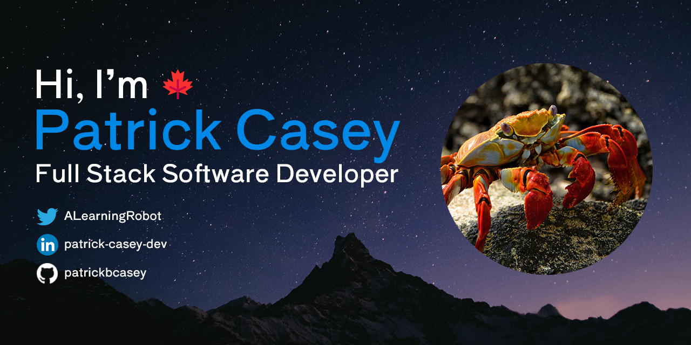

  
  
  
  
    

<h3 align="center">A Canadian 🍁 Full-Stack Software Developer focused on creating tools to makes people's lives easier.</h3>

<h1 align="center">Projects</h1>
<table bordercolor="#66b2b2">
  
  <tr>
    <td width="50%" valign="top">
      <h3 align="center">The Green Exchange</h3>
         
        
         
        

          
    
  
      

        
<strong>Javascript, Bootstrap, MongoDB, Node.js, & Express.js</strong> - Platform to help proud plant parents find other greenthumbs to show off and trade their plants

    </td>
    <td width="50%" valign="top">
      <h3 align="center">Chengyu 4 U</h3>
         
      
         
        

          
  
  
      

        
<strong>Javascript, Tailwind, MongoDB, Node.js, & Express.js</strong> - A website to help Cantonese learners acquire native language skills through the use of traditional Chinese idioms

    </td>
  </tr>
  
  <tr>
    <td width="50%" valign="top">
      <h3 align="center">Portfolio Website</h3>
       
        
       
        

  
  
      

        
<strong>HTML5, CSS3, Sass, & Javascript</strong> - Portfolio Site including links to my projects and ways to get in contact with me.

    </td>
    <td width="50%" valign="top">
      <h3 align="center">Astrogram</h3>
         
        
         
        

          
  
  
      

        
<strong>HTML5, CSS3, & Javascript</strong> - Appreciate the beauty that the universe has to offer. See photos and videos from NASA's Astronomy Photo of the Day API.

    </td>
  </tr>
</table>

<h1 align="center">Technologies</h1>

    
    
    
    
    
    
    
    
    
    
    
    
    
    
    
    
    
    
    
    
    
    
  
  

<h1 align="center">Streak</h1>

<h1 align="center">Connect With Me!</h1>

  
  
  
  
        

